<div align="center">


# PROMETHEUS

### The Execution Intelligence Layer for Data Centre EPC Delivery

**Turning connected project data into connected, auditable, executable decisions — across Design → Build → Operate → Protect.**

<br/>

_Prometheus reads an entire data-centre programme as one connected body of knowledge, and catches the spec deviation, the hidden lead-time conflict or the commissioning gap — with the evidence and the recommended action already attached — while there is still time to fix it._

<br/>

[](https://nextjs.org/)
[](https://react.dev/)
[](https://www.typescriptlang.org/)
[](https://ai.google.dev/)
[](https://vitest.dev/)
[](#roadmap)
[](#license)

<br/>

**[Overview](#the-problem) · [Capabilities](#core-capabilities--five-lenses-one-engine) · [Architecture](#system-architecture) · [Knowledge Graph](#the-knowledge-graph) · [Quick Start](#getting-started) · [API](#api-reference) · [Roadmap](#roadmap)**

</div>

---

<div align="center">

<br/>
<sub><b>Global Supply-Chain Ops Console</b> — live critical-equipment shipments, vendor risk overlay, and the decision Prometheus recommends, on one surface.</sub>
</div>

---

## Contents

- [The Problem](#the-problem)
- [Why Existing Tools Don't Solve It](#why-existing-tools-dont-solve-it)
- [The Solution](#the-solution)
- [Product Gallery](#product-gallery)
- [Core Capabilities — Five Lenses, One Engine](#core-capabilities--five-lenses-one-engine)
- [How It Works — The Intelligence Pipeline](#how-it-works--the-intelligence-pipeline)
- [The Knowledge Graph](#the-knowledge-graph)
- [Agent Architecture](#agent-architecture)
- [System Architecture](#system-architecture)
- [Technology Stack](#technology-stack)
- [Security, Isolation & Explainability](#security-isolation--explainability)
- [Repository Structure](#repository-structure)
- [Getting Started](#getting-started)
- [API Reference](#api-reference)
- [The Five-Minute Demo](#the-five-minute-demo)
- [Roadmap](#roadmap)
- [Engineering Principles](#engineering-principles)
- [Who It's For](#who-its-for)
- [License](#license)
- [Acknowledgements](#acknowledgements)

---

## The Problem

> Building a data centre today is a **supply-chain and coordination problem wearing a construction costume.**

The AI build-out has compressed delivery cycles below **18 months** — while the equipment on the critical path moved the other way. Large power transformers now quote **80–128 weeks** (custom units stretch to 3–5 years), medium-voltage switchgear **44–80 weeks**, and cooling distribution units **26–52 weeks**, with demand up over **150% year-on-year**.

In that squeeze, programmes don't fail for lack of data. They fail because a single **disconnected assumption** hides in a PDF until it detonates the critical path a year later:

- a submittal that quietly **deviates from a governing code clause**,
- a lead time that reads **"52 weeks" in one document and "78" in another**,
- a **commissioning dependency** nobody ever linked to the schedule.

<div align="center">

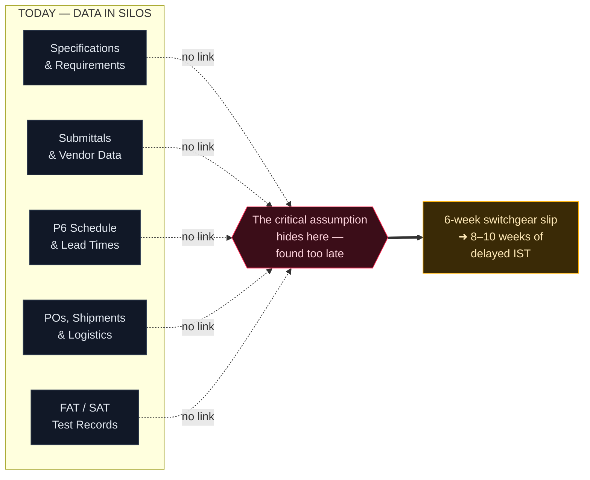

</div>

Industry data puts schedule overruns on roughly **nine in ten** large infrastructure projects, and weak interface management alone can add up to **~18% to project cost**. The information to prevent all of this already exists. **What is missing is a layer that reasons across it.**

---

## Why Existing Tools Don't Solve It

Each incumbent owns one silo. None of them reasons *across* the delivery thread.

| Category | What it is | Why it leaves the gap open |
| :--- | :--- | :--- |
| **BIM / Autodesk** | Design & document authoring | Models geometry, not reasoning across delivery |
| **Primavera P6** | Scheduling | Holds the timeline, not the assumptions behind it |
| **Aconex / doc control** | Document storage & transmittals | Stores documents; does not understand or connect them |
| **Procore** | Construction workflow | Manages process, not cross-silo prediction |
| **Generic "LLM-over-your-PDFs"** | Naïve RAG chatbot | Unreliable on engineering tables & drawings; can't answer multi-hop, relational questions; can't prove its claims |

A dashboard that tells you a transformer is late **after** it is late has added nothing. The layer has to **predict, recommend, and — under human approval — act.**

---

## The Solution

**Prometheus is an execution-intelligence layer.** It ingests every project artefact, binds it into a **typed Project Knowledge Graph** governed by a data-centre EPC ontology, and runs a team of specialised AI agents that continuously reason over that graph. Every finding is **explainable by construction** — it carries its citations and reasoning trace — and ends in a **recommended, executable action behind a human-approval gate.**

<div align="center">

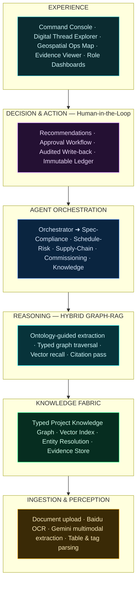

</div>

### The seven principles it is built on

| # | Principle | In practice |
| :-: | :--- | :--- |
| 1 | **Decisions over documents** | Every feature is judged by the decision it improves, not the artefact it stores |
| 2 | **Explainable by construction** | Every output ships with citations and a reasoning trace — no unsourced claim |
| 3 | **Typed graph over free-form triples** | A governed EPC ontology anchors extraction — precise and traversable, not noisy |
| 4 | **Recommend, then act — with a human gate** | Agents propose; a person approves anything that writes back |
| 5 | **Deterministic where checkable** | Numbers, date math and roll-ups are computed by code — the model explains, it never arithmetic-guesses |
| 6 | **One thread, whole lifecycle** | The same graph and agents serve Design, Build, Operate and Protect |
| 7 | **A reusable core** | Swap the ontology and the specialist agents, and the platform generalises to any mission-critical domain |

---

## Product Gallery

A dark-first, industrial operating surface — closer to a Bloomberg terminal than a consumer app. Restrained colour signals *state* (teal = intelligence, amber = at-risk, red = critical, green = ready); every number is one click from its evidence.

### Mission Control

<div align="center">

<br/>
<sub>Operational health, the ranked <b>“what needs a decision today”</b> queue, and the live status of all reasoning agents.</sub>
</div>

<br/>

### The Execution Pipeline & Hybrid RAG

| Ingestion → Extraction → Graph → Reasoning | Live Hybrid-RAG Retrieval |
| :---: | :---: |
|  |  |
| Documents flow through Gemini multimodal extraction into the knowledge graph, surfacing the engineering conflict and the recommended decision. | Every answer shows the **evidence chunks retrieved** and the **knowledge-graph nodes activated** — retrieval you can inspect. |

### Supply-Chain Intelligence

| Geospatial risk & shipment board | Decision detail with reasoning trace |
| :---: | :---: |
|  |  |
| Every shipment, ETA, delay and vendor-risk level — with the single-source and force-majeure exposure surfaced. | Finding → impact → recommended action → **inspectable reasoning trace**, affected assets, and evidence documents. |

### Cross-Project Knowledge & Tenant Isolation

<div align="center">

<br/>
<sub>Organizational memory: matched cross-project precedents, captured lessons, and a <b>tenant-isolation seal</b> proving a foreign tenant's identical pattern was structurally blocked from the answer.</sub>
</div>

---

## Core Capabilities — Five Lenses, One Engine

The five agents are not five products. They are **five reasoning lenses over one graph.** This is why the architecture generalises: adding a sixth capability adds a lens, not a system. Each agent is a **deterministic evaluator** — the AI extracts and explains; the constraint checks, date math and roll-ups are pure, tested code.

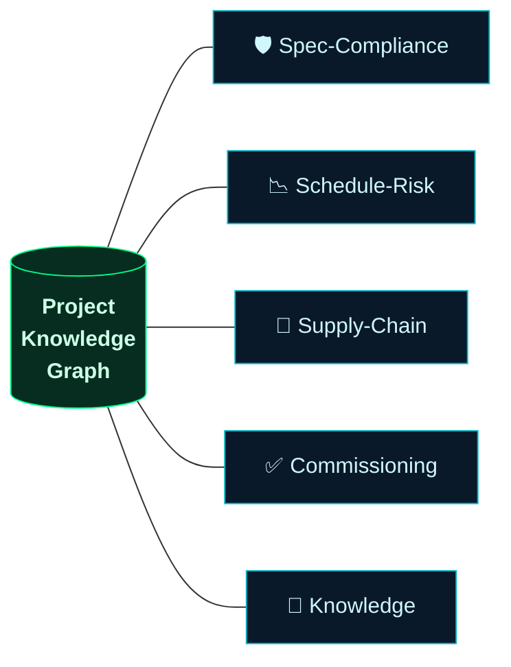

<details open>
<summary><b>🛡 &nbsp;Spec-Compliance Agent</b> — catch the deviation before it's fabricated</summary>

<br/>

- **Purpose** — Continuously verify that submitted equipment, materials and shop drawings satisfy the governing specification and code clauses, and surface every deviation with its evidence.
- **How it works** — Ingest submittal → extract typed values (rating, capacity, make, standard) → resolve to `Equipment`/`Tag` → fetch `Requirement` + `Standard` clause → evaluate conformance with a **deterministic limit evaluator** (`128 kW < required 142 kW ⇒ VIOLATES`) → write a `VIOLATES` edge with the deviation → attach citations → recommend action → human gate.
- **Output** — A side-by-side view of requirement, submitted value, clause and source page; approve · reject · raise-RFI in one action.
- **Impact** — Review collapses from days to minutes; deviations caught **pre-fabrication** avoid rework and schedule loss; code non-compliance is caught **before energisation**.

</details>

<details>
<summary><b>📉 &nbsp;Schedule-Risk Agent</b> — infer the cascade, not just the date</summary>

<br/>

- **Purpose** — Predict schedule risk from long-lead and interface dependencies that hide in PDFs until they hit the critical path.
- **How it works** — Detect a lead-time conflict (`quoted 20 wk` vs `baseline 18 wk`), then **propagate the slip down the `DEPENDS_ON` chain**, absorbing free float activity by activity, until it computes the residual impact at the L5 Integrated Systems Test.
- **Output** — Ranked risks, the conflicting-assumption evidence, an SVG **cascade view**, and a re-baseline recommendation.
- **Impact** — Turns a conflict found at a schedule review a year late into a decision made now. Also surfaces sub-threshold **entity-resolution** ambiguities (`'SU-1' → SU-01 @ 78%`) before they fragment the graph.

</details>

<details>
<summary><b>🚚 &nbsp;Supply-Chain Agent</b> — procurement as a programme item</summary>

<br/>

- **Purpose** — Keep procurement status, lead times and vendor risk inside the schedule's reasoning, not outside it.
- **How it works** — Builds geospatial points and great-circle arcs for every shipment; scores vendor risk from **delivery performance + force-majeure exposure + single-source concentration**; raises findings (e.g. a customs-held critical shipment, a single-source PSU).
- **Output** — Critical-item board, factory/shipment map with flow / route / heatmap modes, and vendor-risk-ranked recommendations.
- **Impact** — Identifies procurement gaps early and recommends alternate-sourcing and expediting decisions.

</details>

<details>
<summary><b>✅ &nbsp;Commissioning Agent</b> — evidence that rolls up to a verdict</summary>

<br/>

- **Purpose** — Drive commissioning readiness across levels **L1–L5** by linking every test record and checklist to the exact equipment and system it certifies.
- **How it works** — Roll `TestRecord` nodes up through `Subsystem` → `System` with a **deterministic worst-of-children** rule per level; compute readiness; link each gap to its **upstream cause** (a late delivery, an open deviation).
- **Output** — System readiness roll-ups, blocked-system dependency chains, and self-assembling turnover packages.
- **Impact** — Clean, on-time turnover — and **no system certified on incomplete evidence.**

</details>

<details>
<summary><b>🧠 &nbsp;Knowledge / Learning Agent</b> — the compounding moat</summary>

<br/>

- **Purpose** — Preserve project context, decisions and resolved issues as durable graph memory, and make prior experience queryable for this project and the next.
- **How it works** — Matches a live risk to how an equivalent problem was resolved on a **prior same-tenant project** (deterministic category match, no LLM guess); captures human rejection rationales as `LearningEntry` records that feed future evaluations.
- **Isolation proof** — A foreign tenant seeds an *identical* pattern purely to demonstrate, via the scoped-traversal seal, that it is **never surfaced across the tenant wall.**
- **Impact** — Fewer repeated mistakes; every resolved deviation makes the next data hall safer — a data network effect.

</details>

### Feature Decision Matrix

Discipline is a differentiator: weak ideas were cut, not carried. _(1 = low, 5 = high.)_

| Capability | Innovation | Demo impact | Judge impact | Business value | Verdict |
| :--- | :-: | :-: | :-: | :-: | :-: |
| Spec-Compliance Agent | 5 | 5 | 5 | 5 | **MUST** |
| Schedule-Risk Agent | 5 | 5 | 5 | 5 | **MUST** |
| Digital Thread Explorer | 4 | 5 | 5 | 4 | **MUST** |
| Evidence Viewer | 4 | 4 | 5 | 4 | **MUST** |
| Command Console | 3 | 4 | 4 | 4 | **MUST** |
| Supply-Chain + Geo Map | 4 | 5 | 5 | 4 | **SHOULD** |
| Commissioning Agent | 4 | 3 | 5 | 5 | **SHOULD** |
| Knowledge / Learning Agent | 5 | 3 | 4 | 5 | **BUILT (Ph 3)** |
| Generic chat over all docs | 1 | 2 | 1 | 2 | **CUT** |
| Auto-generated status reports | 1 | 2 | 1 | 3 | **CUT** |

---

## How It Works — The Intelligence Pipeline

From a raw uploaded PDF to a signed, audited decision — every stage is a real, inspectable step.

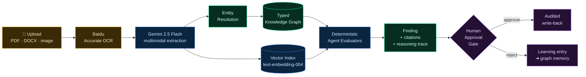

### Hybrid Graph-RAG — retrieval you can prove

Naïve vector RAG is unreliable on engineering corpora. Prometheus fuses three retrieval strategies, so answers are grounded in **typed facts**, not just similar text:

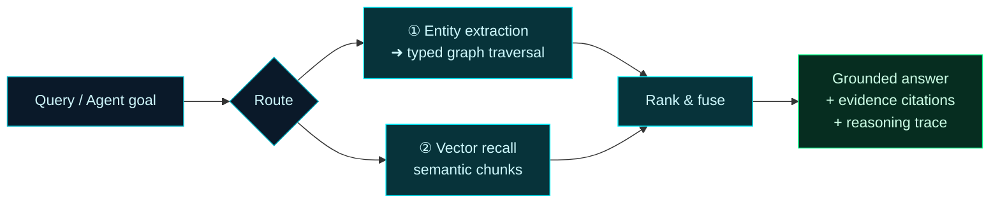

> When the graph or vector layers return nothing, retrieval **degrades gracefully** to a deterministic synthesis over stored findings and specs — the answer is never fabricated, and if `GEMINI_API_KEY` is unset the system still produces a sourced, if terser, response.

---

## The Knowledge Graph

The **Project Knowledge Graph (PKG)** is the heart of Prometheus. It is deliberately **typed and governed**: a predefined data-centre EPC ontology anchors extraction, so the graph is precise and traversable rather than a noisy cloud of LLM-generated triples. The ontology lives as a first-class package (`@prometheus/ontology`) — the schema is the law, enforced at ingestion.

### Core entities — 19 governed types

| Domain | Entity types |
| :--- | :--- |
| **Facility structure** | `Organization` · `Project` · `System` · `Subsystem` · `Equipment` |
| **Specification** | `Specification` · `Requirement` · `Standard` |
| **Procurement** | `Submittal` · `PurchaseOrder` · `Vendor` · `Shipment` |
| **Delivery & assurance** | `ScheduleActivity` · `TestRecord` |
| **Reasoning & provenance** | `Risk` · `Decision` · `Document` · `Person` · `AIAgent` |

Every entity carries an isolation key (`tenantId` / `projectId`), an `owner`, and a **verification state** — `Unverified` → `SystemVerified` → `HumanVerified`.

### Typed relationships — directed, explicit verbs

Ambiguous `RELATES_TO`-style verbs are rejected by construction. A selection of the **24 typed relationship verbs**:

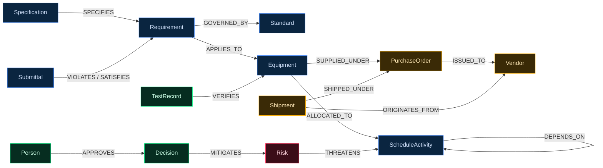

### Reasoning by example

Because the graph is typed, the questions that break naïve RAG become simple traversals. Illustrative, engine-agnostic pseudo-Cypher against the real ontology:

```cypher
// Un-commissioned systems that depend on a late-delivering vendor
MATCH (v:Vendor)<-[:ISSUED_TO]-(:PurchaseOrder)<-[:SUPPLIED_UNDER]-(e:Equipment)
      -[:ALLOCATED_TO]->(:ScheduleActivity)<-[:VERIFIES*]-(t:TestRecord)
WHERE v.delivery_risk = 'HIGH'
RETURN e.tag, v.name ORDER BY v.delivery_risk;

// Submittals that violate a governing code clause
MATCH (s:Submittal)-[r:VIOLATES]->(req:Requirement)-[:GOVERNED_BY]->(c:Standard)
RETURN s.tag, req.parameter, r.deviation, c.clause;

// Schedule cascade from a lead-time conflict
MATCH (e:Equipment)-[:ALLOCATED_TO]->(a:ScheduleActivity)-[:DEPENDS_ON*1..5]->(d:ScheduleActivity)
RETURN e.tag, collect(d.id) AS downstream_at_risk;
```

### Entity resolution — a first-class subsystem

The same tag appears a dozen ways across documents (`TX-01`, `Transformer 01`, `Main Transformer`). Poor resolution silently fragments the graph and breaks every downstream traversal. Prometheus uses **deterministic keys where they exist** (tag numbers, PO numbers), similarity for the rest, and stores a **confidence score and provenance on every merge** — low-confidence merges are flagged for human review rather than assumed.

---

## Agent Architecture

An **orchestrator-worker** topology. Workers never talk to each other — every decision flows through the orchestrator, keeping coordination inspectable and auditable. Shared memory is the graph and the evidence store; there is no hidden inter-agent message bus.

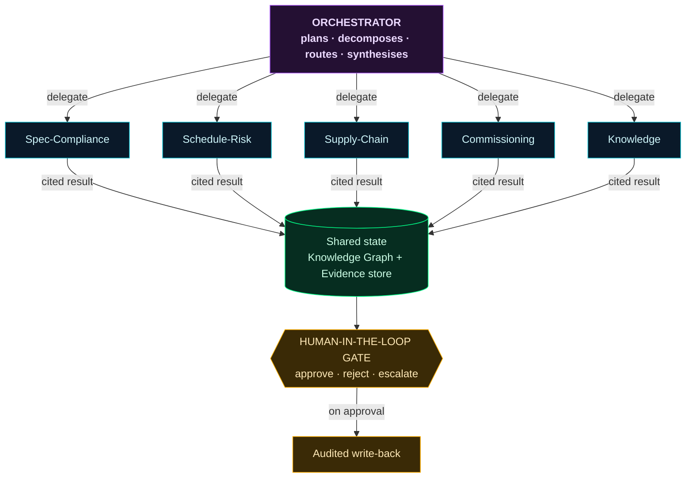

### The human-in-the-loop gate — a feature, not a limitation

Recommendations are automatic; consequential actions are **approved**. This is what makes an EPC director, a government agency and an enterprise CTO willing to deploy the layer.

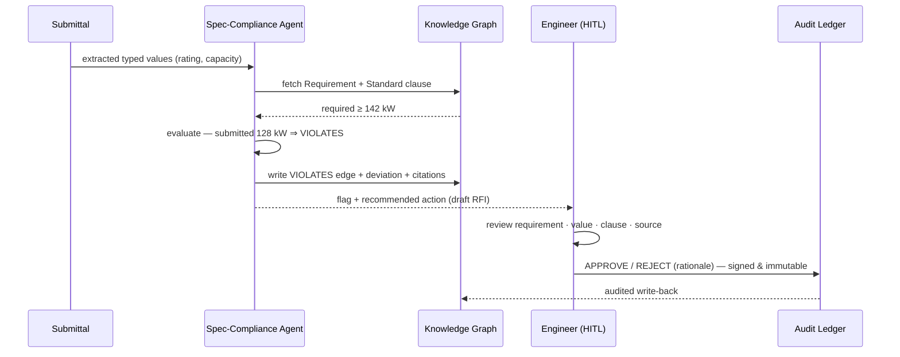

---

## System Architecture

Prometheus follows a **Feature-Sliced** structure on the Next.js App Router: a thin API layer over a typed knowledge fabric and a deterministic reasoning core, with a highly cohesive feature module per capability.

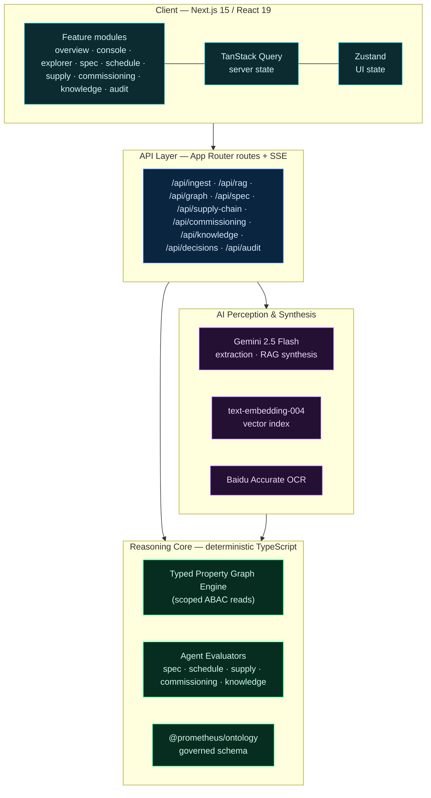

> ### Reference implementation vs. production target
>
> The reasoning core — limit evaluation, schedule cascade, vendor-risk scoring, readiness roll-ups and tenant-isolation ABAC — is **real, deterministic TypeScript, covered by a Vitest golden-set suite.** The knowledge fabric is an in-process typed property graph.
>
> By deliberate design ([ADR-002](docs/ADR/ADR-001-project-structure.md)), the graph engine is exposed **only through a stable tool surface**, so the production target — **Neo4j** (graph), **pgvector / Qdrant** (vectors), **FastAPI** workers, **LangGraph** orchestration, containerised on **Kubernetes** — drops in behind the same contracts, changing only the route implementations. The ontology, payload contracts and the entire workspace are unaffected. The LLM boundary is equally pluggable.

---

## Technology Stack

Every choice is a default with a defensible reason, and the boundaries are pluggable.

| Layer | Selection (this build) | Rationale |
| :--- | :--- | :--- |
| **Frontend** | Next.js 15 (App Router), React 19, TypeScript 5.7 | SSR for heavy dashboards; strong component ecosystem |
| **Design system** | Hand-written CSS design tokens · Outfit + JetBrains Mono | Industrial dark-first look; zero UI-kit default aesthetic ([ADR-009](docs/ADR/ADR-001-project-structure.md)) |
| **Server state** | TanStack Query v5 | Optimistic HITL mutations with rollback |
| **UI state** | Zustand v5 | Lean workspace state (drawers, palette, split view) |
| **Graph / flow viz** | `@xyflow/react` v12 | Interactive knowledge-graph & compliance-graph rendering |
| **Geospatial** | `d3-geo` + `topojson-client` + `world-atlas` | Self-contained equirectangular map — **no external tiles**, air-gap deployable ([ADR-010](docs/ADR/ADR-001-project-structure.md)) |
| **AI extraction & RAG** | Google **Gemini 2.5 Flash** via `@google/genai` | Strong multimodal extraction + structured JSON output |
| **Embeddings** | Gemini `text-embedding-004` | Semantic recall in the vector index |
| **Document OCR** | **Baidu Accurate Basic OCR** | Layout-aware OCR for engineering PDFs (mock fallback offline) |
| **Knowledge fabric** | In-process typed property graph | Swappable for Neo4j behind the same tool surface |
| **Testing** | Vitest | Golden-set unit tests on evaluators & isolation |
| **Deploy** | Vercel or Docker (`node:20-alpine`) | Portable across cloud and on-prem / sovereign clouds |

---

## Security, Isolation & Explainability

Enterprise and government adopters need three guarantees. Prometheus builds them into the architecture, not on top of it.

### Multi-tenant isolation (ABAC)

Isolation is enforced at a **single choke point** — the graph engine's scoped read methods. The API gateway derives a `TenantScope` from the session and never calls the unscoped primitives. An out-of-tenant id returns **404 — indistinguishable from absent**, so existence itself does not leak. The AI inherits the caller's scope: a foreign tenant's identical pattern **cannot** be surfaced by construction.

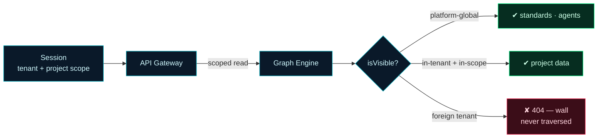

### Explainability by construction

The `cite(docId, blockId)` helper builds every citation from real document anchors and **throws if the anchor is invalid** — an unsourced claim cannot be constructed. Numeric limits, date math and roll-ups use **deterministic evaluators**; the model explains, it does not compute the verdict.

### Auditability

Every recommendation, human decision and write-back is appended to an **immutable audit ledger**. The Audit view replays the full nine-stage lifecycle of any decision — from document upload through Gemini extraction, graph update, retrieval, reasoning, recommendation, engineer review and final signature.

---

## Repository Structure

```
prometheus/
├─ src/
│  ├─ app/                      # Next.js App Router
│  │  ├─ (views)/               # overview · console · explorer · documents
│  │  │                         # spec-compliance · schedule-risk · supply-chain
│  │  │                         # commissioning · knowledge · audit
│  │  └─ api/                   # ingest · rag · ocr · graph · spec · supply-chain
│  │                           # commissioning · knowledge · decisions · audit · repository
│  ├─ features/                # Feature-sliced modules (one per capability)
│  │  ├─ overview/             #   OverviewView + InteractiveKnowledgeGraph + Hybrid-RAG chat
│  │  ├─ console/ schedule/ supply/ commissioning/ knowledge/ explorer/ audit/ …
│  ├─ components/              # Design-system primitives
│  │  ├─ RiskMap · EvidenceViewer · SplitView · VirtualTable · CommandPalette …
│  │  └─ ui/                   #   KnowledgeGraphViewer, badges, tags
│  ├─ core/                    # Cross-cutting client + AI utils
│  │  ├─ state/                #   Zustand workspace store
│  │  ├─ query/ api/           #   React Query providers + hooks
│  │  └─ utils/                #   ai.ts (Gemini) · vector.ts · graph-retrieval.ts · baiduOcr.ts
│  ├─ server/                  # Reasoning core (deterministic)
│  │  ├─ graph/                #   TypedGraph engine · seed data (Phase 1/2/3) · tools (cite)
│  │  ├─ reasoning/            #   spec · schedule · supply · commissioning · knowledge · dates
│  │  │                       #   orchestrator (SSE) · evaluators.test.ts (golden set)
│  │  └─ store.ts             #   in-process PlatformStore
│  ├─ ontology/               # @prometheus/ontology — governed EPC schema (source of truth)
│  └─ lib/                    # NVIDIA AI-Factory reference data
├─ public/
│  ├─ media/                  # product screenshots
│  └─ repository/             # Project Meghdoot — real cross-referenced EPC document corpus
├─ docs/
│  ├─ ADR/                    # Architecture Decision Records
│  ├─ deployment/             # Running & deployment guide
│  └─ research/               # Master Delivery-Intelligence Blueprint (source of truth)
└─ scripts/                   # OCR CLI, corpus tooling, maintenance utilities
```

The **ontology is a first-class package** because it governs everything downstream — extraction is bound to it, and the `@prometheus/ontology` import alias enforces the boundary so the lift to a standalone package is mechanical.

---

## Getting Started

### Prerequisites

- **Node.js** ≥ 18.17 (v20+ recommended) · **npm** ≥ 9

### Install & run

```bash
git clone <your-repo-url> prometheus
cd prometheus
npm install
npm run dev
```

The app is served at **`http://localhost:3000`**. On first launch you'll land on the onboarding wizard — open **Project Meghdoot (NM-1)** to boot the seeded programme and enter Mission Control.

### Production mode (recommended for demos)

For true instant navigation and pre-fetched routes:

```bash
npm run build
npm run start
```

### Environment variables

Prometheus **degrades gracefully** — it runs with no keys at all (deterministic reasoning + mock OCR + fallback synthesis). Add keys to light up the live AI path:

| Variable | Enables | If missing |
| :--- | :--- | :--- |
| `GEMINI_API_KEY` | Gemini extraction, entity recognition, embeddings, RAG synthesis | Falls back to deterministic store-based synthesis |
| `BAIDU_API_KEY` | Baidu Accurate OCR | Falls back to canned mock OCR |
| `BAIDU_SECRET_KEY` | Baidu OCR auth | Falls back to canned mock OCR |

```bash
# .env.local
GEMINI_API_KEY=your_key_here
BAIDU_API_KEY=your_key_here
BAIDU_SECRET_KEY=your_key_here
```

### Tests & type-checking

```bash
npm run test        # Vitest golden-set: evaluators, cascade math, tenant isolation
npm run typecheck   # tsc --noEmit
```

### Docker

A multi-stage `node:20-alpine` build is documented in the [Running Guide](docs/deployment/RUNNING_GUIDE.md), suitable for a corporate intranet or private data-centre deployment.

---

## API Reference

Actions are always **two-step: recommend, then approve.** Streaming endpoints use Server-Sent Events.

| Method & path | Purpose |
| :--- | :--- |
| `POST /api/ingest` | Stream a document through OCR → Gemini extraction → graph + vector ingest (SSE) |
| `POST /api/ocr` | Run Baidu Accurate OCR on a base64 document |
| `POST /api/rag` | Hybrid Graph-RAG query → cited answer + graph facts + evidence chunks + reasoning trace |
| `GET /api/graph/neighborhood?id=&depth=` | Tenant-scoped entity neighbourhood (Thread Explorer) — 404 out-of-tenant |
| `GET /api/entities` | Tenant-scoped entity index (command-palette search) |
| `GET /api/spec` | Open spec deviations with citations |
| `GET /api/supply-chain` | Critical-item board + geospatial points & arcs |
| `GET /api/commissioning` | L1–L5 readiness roll-up + gap findings |
| `GET /api/knowledge` | Cross-project precedents, lessons & tenant-isolation proof |
| `GET /api/decisions` | Ranked decision queue + findings |
| `POST /api/decisions/{id}/approve` | Human-approval gate → audited write-back |
| `POST /api/decisions/{id}/reject` | Reject with rationale → appended to graph memory |
| `GET /api/runs/{findingId}` | Replay a finding's reasoning trace step-by-step (SSE) |
| `GET /api/audit` | Immutable ledger of recommendations, decisions & write-backs |
| `GET /api/repository?action=tree\|cross-refs\|file` | Browse the EPC document corpus |

---

## The Five-Minute Demo

The demo has one job: make it clear this is the **intelligence layer**, not a chatbot — by catching two real, expensive problems live, with evidence and a recommended action.

| Time | On screen | What it proves |
| :-- | :--- | :--- |
| **0:00–0:30** | **Mission Control** — today's ranked decisions across the programme | An operating layer, not a chat box |
| **0:30–1:30** | **Spec-Compliance** — a switchgear submittal flagged `VIOLATES` a clause; Evidence Viewer shows requirement, value, clause and source page together | It reasons — and it proves it |
| **1:30–2:45** | **Schedule-Risk** — two documents disagree on lead time; the cascade into L4/L5 commissioning and the cost of finding it late | Predictive intelligence catching a critical-path killer |
| **2:45–3:30** | **Recommended action + human gate** — re-baseline, open the procurement gate; approved in one click, written back and audited | It recommends and acts — with control |
| **3:30–4:15** | **Thread Explorer + Geospatial** — navigate spec ↔ submittal ↔ PO ↔ shipment on a map of factories and in-transit units | No silos — the whole thread, connected |
| **4:15–5:00** | **Knowledge** — a live risk matched to a prior project's resolution, with the tenant wall proven | A continuously-learning operating layer |

The two catches run against **deterministic seeded data**, so they are reproducible; live ingestion is shown separately, off the critical demo path.

---

## Roadmap

```mermaid
gantt
    title Prometheus — phased delivery (indicative sequencing)
    dateFormat X
    axisFormat %s
    section Phase 0 · Foundation
    Ontology · ingestion · graph + vector fabric · security      :done, p0, 0, 2
    section Phase 1 · MVP Core  ✅ shipped
    Spec-Compliance + Schedule-Risk agents                        :done, p1a, 2, 3
    Evidence Viewer · Thread Explorer · Command Console · HITL     :done, p1b, 3, 2
    section Phase 2 · Delivery Suite  ✅ shipped
    Supply-Chain + geospatial ops map                             :done, p2a, 5, 3
    Commissioning L1–L5 roll-ups                                  :done, p2b, 6, 2
    section Phase 3 · Enterprise Scale  ✅ shipped
    Knowledge / Learning agent · multi-tenant isolation           :done, p3, 8, 4
    section Production hardening
    Neo4j · pgvector · FastAPI · LangGraph · Kubernetes           :active, prod, 8, 4
```

**Shipped:** all five agents, the Digital Thread Explorer, Evidence Viewer, Command Console, geospatial ops map, L1–L5 commissioning roll-ups, cross-project knowledge and ABAC tenant isolation.
**Next:** migrate the pluggable boundaries to the production stack (Neo4j / pgvector / FastAPI / LangGraph on Kubernetes), OIDC/SSO, and connectors to external systems of record behind the MCP tool gateway.

---

## Engineering Principles

Every deviation and open decision is recorded as an [Architecture Decision Record](docs/ADR/ADR-001-project-structure.md). A few that define the product:

| ADR | Decision |
| :--- | :--- |
| **002** | The knowledge fabric and agents are **deterministic** — swappable for Neo4j/FastAPI/LangGraph behind the same contracts |
| **003** | **Zero modals** — the human gate is an inline `alertdialog`, preserving context |
| **004** | **Do not guess; compute** — canonical numbers (e.g. the 8-week IST slip) are derived, not asserted |
| **005** | The command palette returns **entities and actions, never chat** |
| **009** | A hand-written **CSS design-token system** — no default UI-kit aesthetic |
| **010** | A self-contained **SVG geospatial map** — zero external tiles, air-gap deployable |
| **013 / 014** | **Tenant isolation** via scoped graph reads; cross-project memory as same-tenant resolved decisions |

---

## Who It's For

| Buyer | Primary pain | Value they buy |
| :--- | :--- | :--- |
| **EPC / EPCM contractors** | Overruns, rework, commissioning slip | Protected margin & on-time delivery |
| **Hyperscale / colo owners** | Missed energisation, stranded capital | Earlier, de-risked revenue |
| **Owner's engineers / Cx agents** | Fragmented L1–L5 evidence | Clean, provable turnover |
| **Government / public infrastructure** | Trust, auditability, sovereignty | Explainable, on-prem, compliant delivery intelligence |

All four share the same DNA — **mission-critical delivery under supply-chain pressure.**

---

## License

Proprietary — built for the **ET AI Hackathon 2026, Problem Statement 4** (AI Intelligence Platform for Data-Centre EPC Project Delivery), in the context of the Octave (Hexagon Asset Lifecycle Intelligence) partner ecosystem. All rights reserved. See the source of truth in [`docs/research`](docs/research/Prometheus_Master_referrence_document.md).

---

## Acknowledgements

Grounded in primary and official sources: **Octave / Hexagon** (Design → Build → Operate → Protect positioning), **ASHRAE** Guideline 0 & 1.6 and **Uptime Institute** / **TIA-942** (commissioning & reliability), **Microsoft Research GraphRAG**, and **Anthropic's** orchestrator-worker multi-agent guidance. Full citations in the [Master Delivery-Intelligence Blueprint](docs/research/Prometheus_Master_referrence_document.md).

<div align="center">
<br/>

<br/><br/>
<b>PROMETHEUS</b><br/>
<sub><i>"Building a data centre is a coordination problem wearing a construction costume. We un-silo the intelligence."</i></sub>
<br/><br/>
<sub>From connected <b>data</b> to connected <b>decisions</b> — across the entire asset lifecycle.</sub>
</div>
